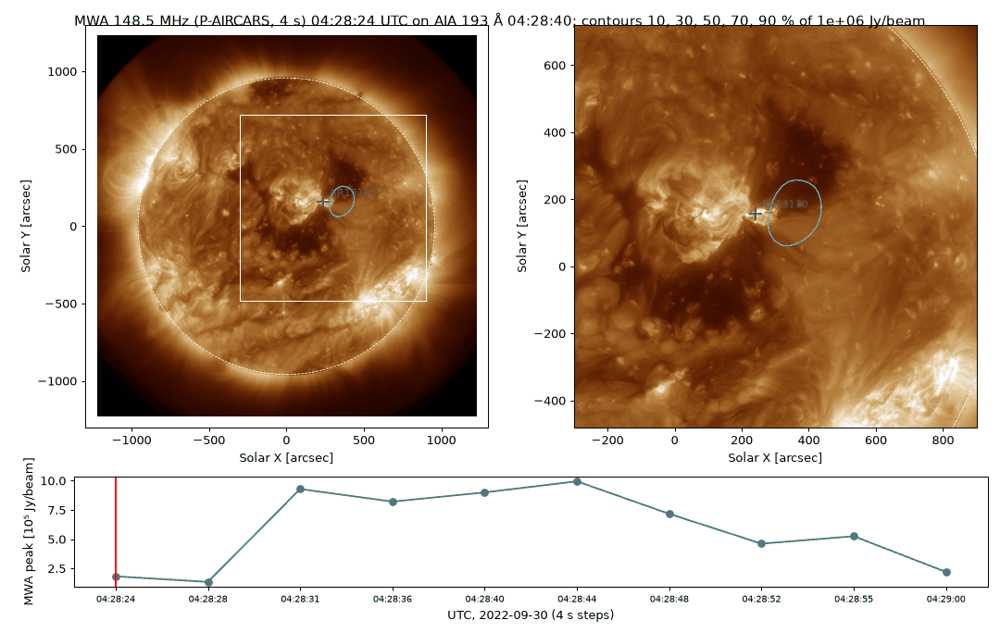
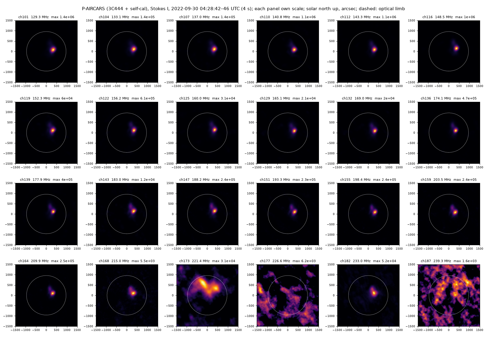
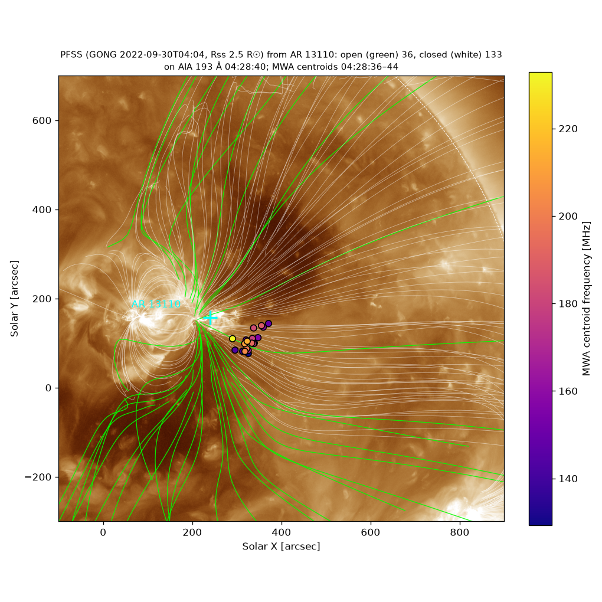
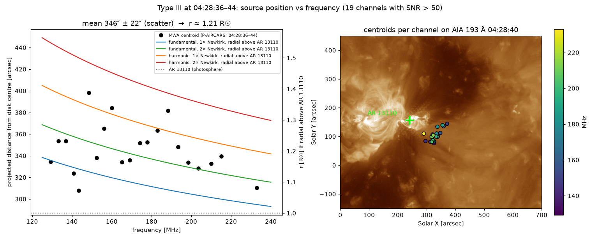
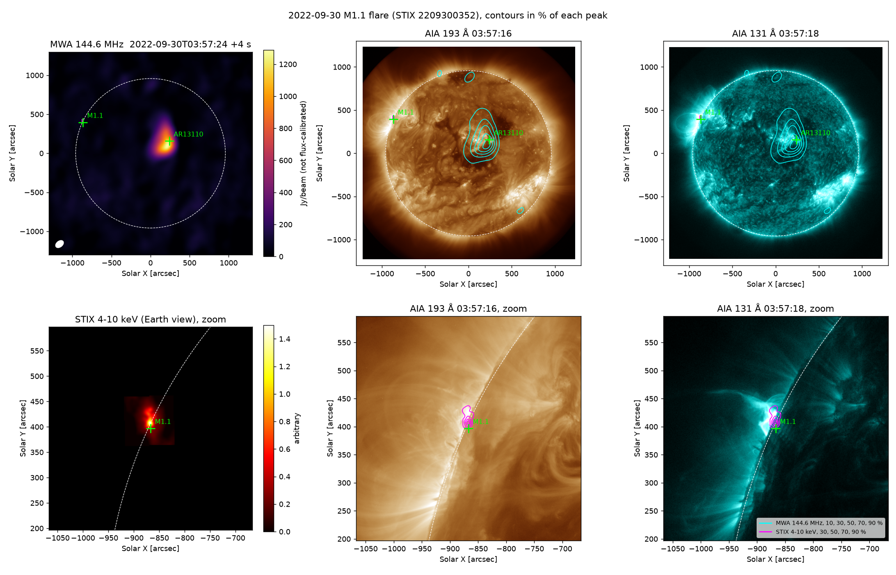
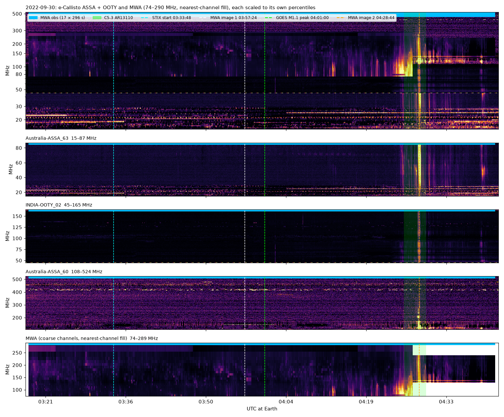
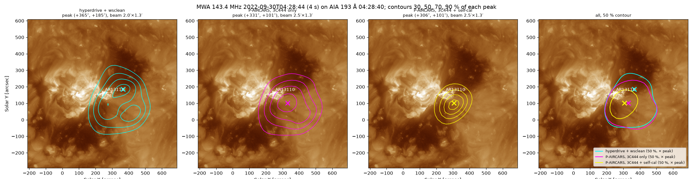
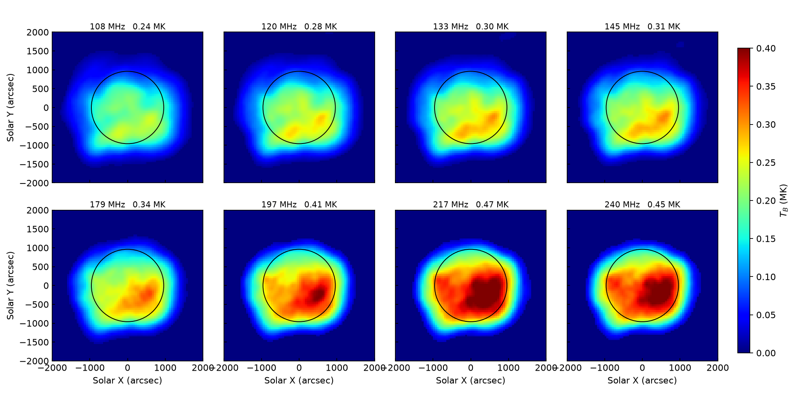
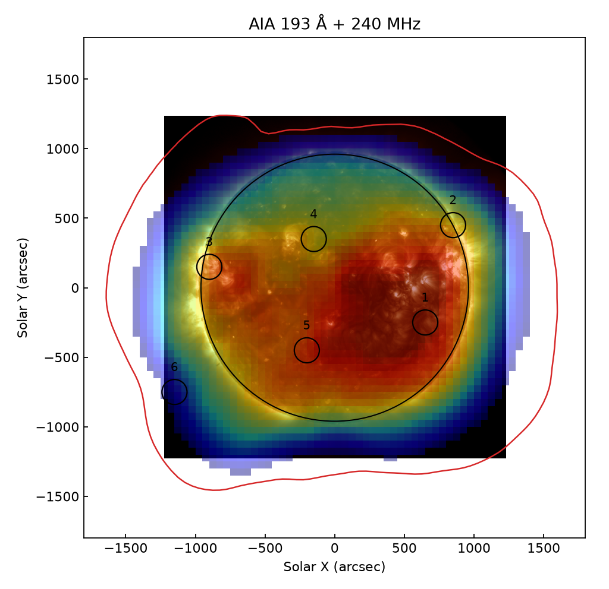

# Solar radio imaging spectroscopy

André Csillaghy's 2026 sabbatical (FHNW, Institute for Data Science): **how
AI-assisted ("agentic") software can help us make and understand radio images
of the Sun.** This page shows the main results so far. The code lives in the
repositories listed at the end.

**Why radio images of the Sun?** When the Sun flares, it accelerates electrons
to high speeds. Some of them race out through the solar atmosphere along
magnetic field lines and make the gas there emit radio waves. The radio
frequency tells us how dense the gas is, and therefore roughly how high above
the surface the emission comes from. Radio telescopes such as the Murchison
Widefield Array (MWA) in Western Australia, and soon the SKA, can take pictures
of this emission many times per second. The data volumes are large and the
processing chains complex, which is where better software, and AI assistance,
can help.

---

## Highlight 1 — Watching a solar radio burst take off (30 September 2022)

*Cyan contours: a radio burst seen by the MWA at 148.5 MHz, in 4-second steps
over 40 seconds, on top of an extreme-ultraviolet image of the Sun from NASA's
Solar Dynamics Observatory. Left: the whole Sun. Right: a zoom on the active
region (the bright area, marked AR 13110). Bottom: brightness of the burst
over time. The burst switches on within a few seconds, peaks, and fades within
half a minute.*

This was the first solar event we took from the institute's own archive of MWA
observations and processed end to end on our computing cluster (calculon),
from the archived data to calibrated images.

*The same moment at 24 frequencies between 129 and 239 MHz. The burst is clearly
visible in 21 of them, always at the same place, just west of the active
region. (The three noisy panels at the top end of the band did not calibrate
well.)*

## Highlight 2 — How high above the Sun? Following the magnetic field

*Lines: a model of the Sun's magnetic field, computed from a magnetic map of the
solar surface taken 25 minutes earlier. Green lines are "open": they reach out
into interplanetary space, so fast electrons can escape along them. White lines
are closed loops. Dots: where the radio burst is seen at each frequency. The
radio sources sit right on the bundle of open field lines leaving the active
region.*

*Left: distance of the radio source from the centre of the Sun's disk at each
frequency, compared with what standard models of the solar atmosphere predict.
Right: the same positions on the ultraviolet image.*

Two independent methods give the same answer: the burst comes from about
**1.2 solar radii from the Sun's centre, roughly 140,000 km above the visible
surface** (about eleven times the diameter of the Earth). One method uses the
radio frequency and models of how the gas density falls with height; the other
uses where the open magnetic field lines cross the observed positions.

## Highlight 3 — Three instruments, one picture: radio, X-rays and ultraviolet

*Top: the whole Sun in radio (MWA, left) and ultraviolet (SDO/AIA). Bottom: zoom
on the large flare of that morning at the north-east edge of the Sun, seen in
X-rays by STIX on the European Solar Orbiter spacecraft (magenta contours).*

A larger flare (class M1.1) happened the same morning at the edge of the Sun.
Solar Orbiter was almost exactly behind the Sun as seen from Earth, so its
X-ray telescope STIX saw the flare from the other side. After converting its
image to our point of view, the X-ray source lands within 15 arcseconds
(about 1.5 % of the Sun's radius) of where the flare is seen in ultraviolet.
Interestingly, this large flare was quiet in radio at these frequencies; the
radio activity came from the other, smaller active region near the centre.

## Highlight 4 — Combining a large radio telescope with a citizen-science network

*Radio "dynamic spectra": frequency (vertical) against time (horizontal) over
about an hour. Bright vertical streaks are bursts of fast electrons. The top
panel combines all instruments; below are stations of e-Callisto, a worldwide
network of small radio spectrometers coordinated at FHNW (Australia and India
here), and the MWA (bottom).*

e-Callisto stations observe the Sun around the clock with simple receivers; the
MWA observes only at certain times, but with far higher sensitivity and with
images. Put together, they show which events the small stations catch and
which only the large telescope sees.

## Highlight 5 — Better images with self-calibration (P-AIRCARS on our cluster)

*The same 4-second radio image produced three ways, on an ultraviolet image of
the active region. Left: standard calibration on a reference radio source.
Middle and right: with P-AIRCARS, a pipeline built specifically for solar MWA
data, without and with self-calibration. Self-calibration refines the
calibration using the Sun itself, which makes the image about 4.5 times
cleaner. All three agree on where the burst is.*

Getting P-AIRCARS to run on our cluster uncovered several software problems in
the pipeline's cluster mode, which we fixed and documented; we plan to offer
the fixes to its developers.

## Highlight 6 — Reproducing a published study

*The radio Sun at eight frequencies between 108 and 240 MHz, rebuilt from the
data of Sharma et al. (2022, Astrophysical Journal 937, 99). Colours show the
radio brightness temperature in millions of kelvin.*

*Radio emission at 240 MHz (colours) over the ultraviolet Sun, with the regions
studied in the paper (circles).*

As a first step we rebuilt the figures of a published MWA study from its
original data products. This is how we learned the instrument, its data and its
processing tools.

---

## Where we are (10 October 2026)

**Season I — imaging (October–December).**

- **Done:** understanding the MWA and its data; the MWA processing software
  running on a laptop, on our cluster (calculon) and at the Swiss National
  Supercomputing Centre (CSCS); reproduction of Sharma et al. 2022.
- **In progress:** calibration of MWA solar data; the solar-specific pipeline
  P-AIRCARS, now running on our cluster; the first events from our own MWA
  archive (the 30 September 2022 event above); combining MWA with e-Callisto,
  STIX and SDO.
- **Next:** images at the MWA's finest time resolution (a quarter of a second;
  the data have been requested from the MWA archive); polarisation, which
  tells us more about how the radio waves are produced; checking the absolute
  positions and brightness scale; more events from the archive.

**Season II — e-Callisto (January–March, Mexico)** has not started yet.

The detailed plan is in [docs/sabbatical-plan.md](docs/sabbatical-plan.md), the
latest progress report in [docs/progress-2026-10-09.md](docs/progress-2026-10-09.md),
and the scientific write-up of the 30 September event in
[docs/handover-2022-09-30-science-results.md](docs/handover-2022-09-30-science-results.md).
Work is tracked on the [GitHub Project](https://github.com/orgs/i4Ds/projects/18).

## Repositories

This repository is the map, not the code.

| Repository | What it is for |
|------|------|
| [solar-burst-multiview](https://github.com/i4Ds/solar-burst-multiview) | MWA solar imaging: the reproduction of Sharma et al. 2022, the 30 September 2022 event, P-AIRCARS on the laptop and the cluster, software setup on calculon and CSCS. |
| [STIX-MWA](https://github.com/i4Ds/STIX-MWA) | Combining STIX (X-rays) and e-Callisto with the MWA: STIX images, joint dynamic spectra. |
| [ecallisto_ng](https://github.com/i4Ds/ecallisto_ng) | e-Callisto data access and analysis (Season II). |
| [Karabo-Pipeline](https://github.com/i4Ds/Karabo-Pipeline) | Simulations for the SKA radio telescope. |

## Goals of the sabbatical

- A working prototype of AI-assisted solar radio imaging
- A basis for a doctoral or continuation project (2027–2030)
- An updated e-Callisto analysis package
- Three to five solar events analysed jointly across instruments
- A basis for an SNSF and/or EU proposal on e-Callisto data analysis
